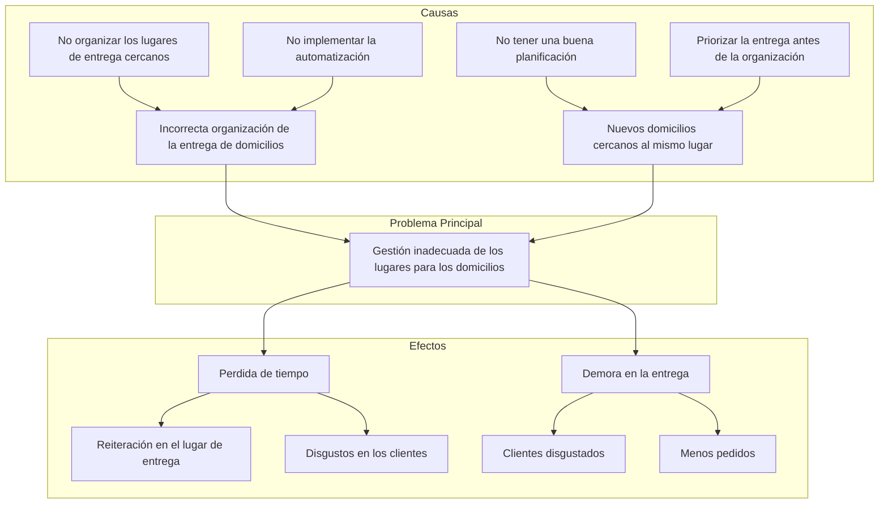

# Laura Valentina Alquichides Barrera

## Contexto problemática

Un familiar tiene un negocio en el cual se realizan domicilios, sin embargo, cuando ya se realizaron los domicilios a un lugar específico, y la persona que realiza los domicilios vuelve a el negocio después de realizar un domicilio, puede volver a salir otro pedido cerca al lugar donde se había realizado el último. Considero que se podría crear una aplicación en la cual, conectando las ubicaciones más cercanas, también integrando un mapa para que le indique a cuál lugar debe ir primero e indicándole en que dirección debería dirigirse. Para que las entregas se realizan de manera correcta y rápida, sin tener que volver a ir a la misma ubicación para el siguiente pedido. Teniendo en cuenta que para volver a realizar los domicilios se vuelva a tener en cuenta la ubicación para realizar una entrega del domicilio de manera óptima.

## Árbol de problemas

## prompt

Mi familiar tiene un negocio que realiza domicilios, pero enfrenta un problema frecuente: cuando el domiciliario regresa al punto de partida tras una entrega, muchas veces surge un nuevo pedido cerca del lugar donde ya había estado. Esta situación genera pérdida de tiempo, demoras en las entregas y clientes insatisfechos, debido a una gestión inadecuada de los lugares para los domicilios, como se muestra en el árbol de problemas. Para solucionar esto, propongo crear una aplicación que conecte automáticamente los pedidos según su ubicación geográfica, integrando un mapa inteligente que indique la mejor ruta y el orden óptimo de entrega. Esta herramienta ayudaría a organizar los domicilios cercanos, evitar repeticiones en la ruta, mejorar la planificación y agilizar el servicio, logrando una entrega más eficiente y una mejor experiencia para los clientes.
## Soluciones tecnologícas

* Plataforma de movilidad inteligente para empresas y ciudadanos: Desarrollar una aplicación o sistemas web en el cual incluya las opciones de movilidad como lo son las bicicletas, SITP, Transmilenio y rutas peatonales, optimizados por IA y datos en tiempo real. El cual este dirigido para las empresas que buscan optimizar la movilidad de sus empleados y para los ciudadanos que buscan rutas eficaces sin tráfico.
Se implementarían funciones como rutas multimodales, alerta sobre el trafico en tiempo real, puntos por usar transporte sostenible, integración con pico y placa y horarios con horarios flexibles.

* Software de automatización para pequeños negocios: Desarrollar una plataforma de gestión digital (ERP ligero) para pequeños negocios como panaderías, papelerías, ferreterías que cuentan con soluciones costosas como SAP o Zoho.
Dirigido para los comercios pequeños o informales y profesiones independientes como consultores, contadores, entre otros. Incluiría funciones como el control de inventario y facturación electrónica, módulo de reservas para los negocios, informes automáticos para tomas de decisiones y una aplicación móvil simple e intuitiva.

* Consultora de soluciones tecnológicas personalizadas: Ofrece servicios de desarrollo a la medida para pequeñas y medianas empresas que
requieren soluciones tecnológicas específicas, como por ejemplos la automatización de procesos, apps internas, integración de APIs o migración a la nube.
Esto estaría dirigido para PYMEs, instituciones educativas, ONG, y startups, también para las empresas que no tiene un equipo de desarrollo propio. además, los posibles servicios que tendría serán desarrollo web/app personalizada, integración de sistemas como los son las ventas online con facturación electrónica, automatización de RPA (Robotic Process Automation) y ciberseguridad y mantenimiento de infraestructura digital.

## Consultora de soluciones tecnológicas personalizadas

La idea que más me llamo la atención fue la de consultora de doluciones tecnologicas personalizadas, porque esta dririgo para los diferentes ámbitos, se puede diseñar de la manera en que el usuario comprenda las funciones que se pueden realizar, manteniendo de manera segura la información que se administre, siendo la solcuion que me parece más adecuada de acuerdo con los distintos requisitios que las empresas necesitan, como lo son las ventas onnline, ya que la tecnología es importatnte integrarla en los entornos que existe, como en la automatización de los procesos.
