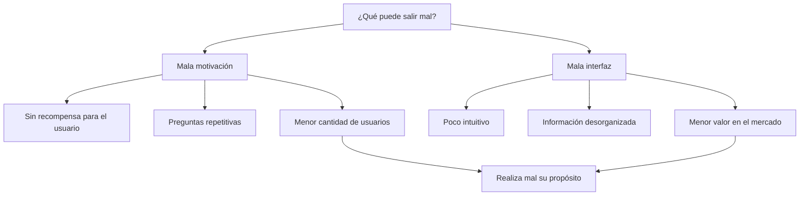

# prototipos_01
--------------------------------------------------------------
# Nicolas Andres Garzon Zea
## contexto problematica
* Mi tío acaba de comenzar un negocio en el cual aun no tiene una base de datos que le proporcione toda la información que necesita de la manera más rápida posible, yo como ingeniero puedo intervenir haciendo una escucha activa del problema para saber que es lo que necesita y que es lo que no necesita en la base de datos, después de un extenso análisis y la creación de un modelo relacional podremos seguir con el programa y sus visuales
## Arbol de problemas

# Prompt

* Como estudiante de Ingeniería de Sistemas, me enfrento a la problemática de que mi tío ha iniciado un nuevo negocio, pero aún no cuenta con una base de datos que le permita gestionar la información de forma rápida y eficiente. Desde mi rol, puedo intervenir aplicando una escucha activa para comprender a fondo sus necesidades reales, diferenciando qué datos son esenciales y cuáles no. Este proceso permitirá un análisis detallado de los requerimientos del sistema, lo cual culminará en el diseño de un modelo relacional adecuado. A partir de este modelo, podremos desarrollar una base de datos funcional y continuar con la implementación del programa, incluyendo sus respectivas visualizaciones, optimizando así la toma de decisiones y la operatividad del negocio.

## Soluciones tecnologicas

* Quiero crear una idea de negocio que sea rentable, escalable y con potencial de crecimiento digital. Estoy interesada en el trafico vial. Sugiere 3 ideas innovadoras que incluyan el uso de tecnología (como apps, plataformas web o soluciones digitales). Me gustaría que fueran accesibles con bajo presupuesto inicial y que puedan crecer progresivamente. Incluye una breve descripción de cada idea, el público objetivo y el problema que resuelve. *

* I. App de Reportes Ciudadanos de Tráfico en Tiempo Real (TráficoVecino)

Descripción:
Una aplicación móvil colaborativa donde los usuarios reportan incidentes viales (accidentes, trancones, obras, semáforos dañados, etc.) en tiempo real, utilizando geolocalización. Integra un mapa interactivo y alertas para prevenir demoras y mejorar la planificación de rutas.

Público objetivo:
Conductores urbanos, repartidores, ciclistas, motociclistas y usuarios de transporte público en ciudades medianas a grandes.

Problema que resuelve:
Falta de información actualizada y localizada sobre condiciones de tráfico, lo que genera demoras, frustración y pérdida de tiempo. También ayuda a las autoridades a detectar puntos críticos.

Escalabilidad:
Puede empezar en una ciudad y expandirse progresivamente a otras regiones. A futuro, se puede monetizar con publicidad local, convenios con empresas de movilidad o integraciones con apps de navegación.

* II. Plataforma Web de Educación Vial Interactiva (VíaInteligente)

Descripción:
Una plataforma web gamificada con cursos cortos, simuladores y quizzes para educar a jóvenes y nuevos conductores sobre normas de tránsito, comportamiento vial y seguridad. Incluye módulos personalizados según el tipo de usuario (peatón, ciclista, conductor).

Público objetivo:
Estudiantes, futuros conductores, padres de familia, colegios y empresas de transporte interesadas en capacitar a su personal.

Problema que resuelve:
Bajo conocimiento de normas de tránsito y falta de cultura vial, que con frecuencia deriva en accidentes evitables.

Escalabilidad:
Puede iniciar como una plataforma gratuita o freemium, y luego ofrecer suscripciones para instituciones educativas o certificaciones digitales pagas.

* III. Sistema de Gestión de Parqueo Inteligente para Pequeños Negocios (SmartParkPyme)

Descripción:
Una app/web sencilla que permite a pequeños parqueaderos (tiendas, residencias, negocios) administrar sus espacios, horarios y reservas de parqueo en tiempo real. Incluye escaneo QR o código PIN para el ingreso/salida de vehículos.

Público objetivo:
Pequeños negocios o conjuntos residenciales que ofrecen parqueo limitado y no pueden pagar soluciones costosas.

Problema que resuelve:
Desorganización y pérdida de tiempo en la gestión de parqueaderos informales. Facilita el control y optimiza el uso del espacio disponible.

Escalabilidad:
Comienza con una versión básica y puede evolucionar a integrar pagos digitales, cámaras de reconocimiento de placas o una red de parqueaderos disponibles en ciudades.

# la idea mas factible
* Plataforma Web de Educación Vial Interactiva (VíaInteligente)
se me hace una idea mucho mas factible y facil de utilizar al educar a la gente desde una edad temprana, sobre la seguridad vial, la leyes de transito y acostumbrandolos a manejar mejr el estres de conducir
